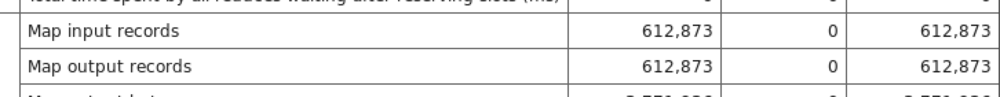
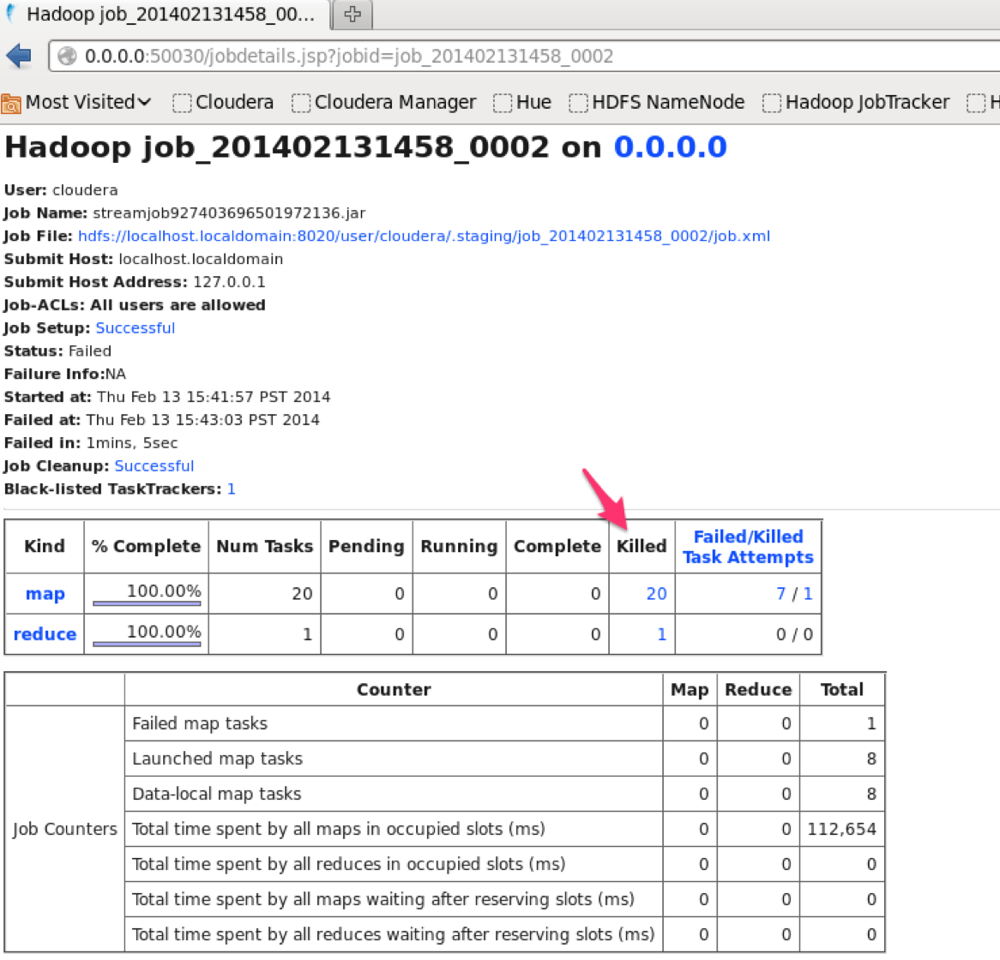
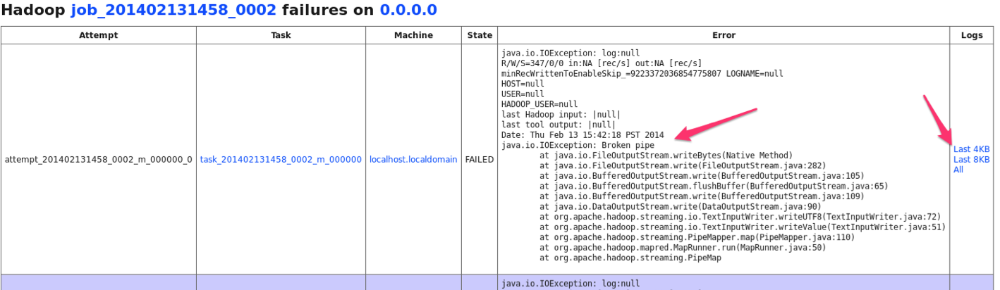
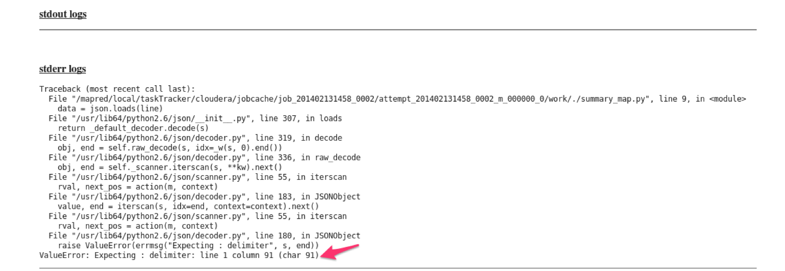

Exploring the Data Set
=====================
step1. Profile the data
----------------------
任何数据分析之前，都要对数据有一个大概的了解。

**基本思想就是**：
1. 分析数据大小，几乎是例行要做的
2. 分析各个特征的含义和分布

这里面需要用到很多linux的命令行，用熟悉了之后感觉还是挺方便的。先大体介绍几个简单函数： 

```
man cmd:  显示对cmd的所有解释。不懂的就man一下 :)
head:  当数据量很大的时候，先看前面几行文件会很快捷
tail:  和head对应，显示最后几行内容。head和tail都可以通过-n参数指定显示几行
du -sh dir/file:  以人类可读的形式显示目录或file的总大小
wc -l file:  显示文件file的行数，file可以是一个文件，也可以带通配符，如*.cpp
ls -Rlh:  ls应该是linux里面最常用的功能了，就是显示文件列表。-Rlh其实是-R -l -h的简写。linux的很多命令都可以这样。具体什么意思man ls一下	
find:  linux里面比较强大的命令了，可以根据文件类型、正则表达式、时间戳、权限等多种条件综合搜索。比较常见的几种用法汇总如下：
find . -type f:  找出所有文件，不包括目录、软链等其他类型
find . -name "*.cpp":  找出所有以cpp为后缀的文件（可能是目录），会遍历目录下的所有子目录
find . -name "excercise*" -maxdepth 1:  仅在当前目录，找出所有以excercise为前缀的文件
xargs:  linux内部最强大的中介，和其他命令组合可以实现很多及其复杂的功能。xargs会把管道中上一个命令的输出作为其他命令的参数，示例如下：
find . -type f -name "*.cpp"|xargs grep "interesting": 在所有cpp后缀的文件中，grep含interesting的文件 
echo -e "kid\nrank"|xargs -i -n1 grep "{}" */*.sh:  等效于在当前所有子目录的以.sh为后缀的文件中，分别执行grep kid和grep rank两个命令。所以xargs可以有效减少loop的使用。当然效率可能会低一些。
grep:  正则匹配查找。上面也讲了一些，但是只是九牛一毛。最好的方法还是man一下  
```
有了以上的工具之后，你就可以尽情的去欣赏数据了。
在本例中，你可以这样：
```
$ cd ~/data 
$ du -sh . # 查看目录大小
201M .
$ ls -Rlh  # 递归显示目录及子目录大小
./heckle:
total 103M
-rw-r--r-- 1 cloudera cloudera  18M Oct 18  2013 web.log
-rw-r--r-- 1 cloudera cloudera  18M Oct 18  2013 web.log.1
-rw-r--r-- 1 cloudera cloudera 253K Oct 18  2013 web.log.2
-rw-r--r-- 1 cloudera cloudera  14M Oct 18  2013 web.log.3
-rw-r--r-- 1 cloudera cloudera  12M Oct 18  2013 web.log.4
-rw-r--r-- 1 cloudera cloudera 2.1M Oct 18  2013 web.log.5
-rw-r--r-- 1 cloudera cloudera 656K Oct 18  2013 web.log.6
-rw-r--r-- 1 cloudera cloudera  11M Oct 18  2013 web.log.7
-rw-r--r-- 1 cloudera cloudera  15M Oct 18  2013 web.log.8
-rw-r--r-- 1 cloudera cloudera  14M Oct 18  2013 web.log.9

./jeckle:
total 99M
-rw-r--r-- 1 cloudera cloudera  18M Oct 18  2013 web.log
-rw-r--r-- 1 cloudera cloudera  16M Oct 18  2013 web.log.1
-rw-r--r-- 1 cloudera cloudera 3.5K Oct 18  2013 web.log.2
-rw-r--r-- 1 cloudera cloudera  15M Oct 18  2013 web.log.3
-rw-r--r-- 1 cloudera cloudera 9.2M Oct 18  2013 web.log.4
-rw-r--r-- 1 cloudera cloudera 2.1M Oct 18  2013 web.log.5
-rw-r--r-- 1 cloudera cloudera 505K Oct 18  2013 web.log.6
-rw-r--r-- 1 cloudera cloudera  11M Oct 18  2013 web.log.7
-rw-r--r-- 1 cloudera cloudera  15M Oct 18  2013 web.log.8
-rw-r--r-- 1 cloudera cloudera  14M Oct 18  2013 web.log.9

$ cd heckle
$ wc -l * ＃ 文件行数
    50905 web.log
    48230 web.log.1
      726 web.log.2
    39978 web.log.3
    32779 web.log.4
     6673 web.log.5
     2015 web.log.6
    36169 web.log.7
    49729 web.log.8
    46273 web.log.9
   313477 total
$ head -5 heckle/web.log ＃ 大体看一下
{"auth": "15a63c4:e66189ba", "createdAt": "2013-05-12T00:00:01-08:00", "payload": {"itemId"": "15607", "marker": 240}, "refId": "47c7e2f6", "sessionID": "82ada851-0b3c-4e9d-b8cf- 0f0a2ebed278", "type": "Play", "user": 22700996, "userAgent": "Mozilla/4.0 (compatible; MSIE 7.0; Windows NT 5.1; .NET CLR 1.1.4322; .NET CLR 2.0.50727; InfoPath.1)"}
{"auth": "1547142:7d3d41c7", "createdAt": "2013-05-12T00:00:03-08:00", "payload": {"itemId"": "6210", "marker": 3420}, "refId": "141ac867", "sessionID": "d95bc727-033f-4f62-831a- 2f8d6740a364", "type": "Play", "user": 22311234, "userAgent": "Mozilla/5.0 (Windows NT 6.0) AppleWebKit/535.7 (KHTML, like Gecko) Chrome/16.0.912.75 Safari/535.7"}
{"auth": "30af4f8:2527ff80", "createdAt": "2013-05-12T00:00:09-08:00", "payload": {"itemId"": "32009", "marker": 2760}, "refId": "fdec4481", "sessionID": "673ee60a-0aa2-4eac-a6fb- 8a68d053dbf3", "type": "Play", "user": 51049720, "userAgent": "Mozilla/5.0 (X11; Linux x86_64) AppleWebKit/535.19 (KHTML, like Gecko) Chrome/18.0.1025.142 Safari/535.19"}
{"auth": "6f691c:455e17cb", "createdAt": "2013-05-12T00:00:10-08:00", "payload": {"itemId"": "7347", "marker": 1059}, "refId": "4b5021f4", "sessionID": "2d3aef1d-ec8d-4053-8c40- e8579e547745", "type": "Play", "user": 7301404, "userAgent": "Mozilla/4.0 (compatible; MSIE 8.0; Windows NT 5.1; Trident/4.0; WDL6.1.1; .NET CLR 1.1.4322; .NET CLR 2.0.50727)"}
{"auth": "1208d4c:279737f7", "createdAt": "2013-05-12T00:00:11-08:00", "payload": {"itemId"": "3702e4", "marker": 780}, "refId": "7586e549", "sessionID": "d4a244cb-d502-4c94-a80d- 3d26ca54a449", "type": "Play", "user": 18910540, "userAgent": "Mozilla/4.0 (compatible; MSIE 8.0; Windows NT 6.1; Trident/4.0; GTB7.2; SLCC2; .NET CLR 2.0.50727; .NET CLR 3.5.30729; .NET CLR 3.0.30729; Media Center PC 6.0; InfoPath.2)"}

```


step2. Load data into hdfs
--------------------------
调用如下命令把data目录整个copy到虚拟机的hadoop集群：

```
hadoop fs -copyFromLocal data
```
命令原型如下：data就是此时的localsrc，des不指定就是hadoop的home目录
```
hadoop fs [generic options] -copyFromLocal <localsrc> ... <dst>
```
上传完之后使用`hadoop fs -ls`命令看一下data目录是否存在

`hadoop fs -help`可以看到所有和文件系统（fs）相关的命令函数帮助信息

实际中，如果真是大数据的话，是不可能从本地上传的，如果日志已经存放在hadoop集群上，可能需要distcp从那个集群拷贝到你所在的集群；如果日志是散布在很多类似zookeeper的节点上，就需要写一个map脚本，每个mapper都负责把一部分节点上的日志wget到本地，然后put到集群上。

step3. Determin Event types
----------------------------
通过对问题的分析和刚才的观察，我们发现，event将是我们后面分析的重点。因此分析event的类型分布将是首先要做的。(本节代码见scripts/exploring目录)

对于nominal特征，我们一般要回答如下几个问题：特征有多少种值类型，每种比例大概多少，是否有missing value。当面对大数据时，我们必须写hadoop/spark代码才能解答我们上面的问题。不过有一个经验是：先在本地小数据上验证一下代码，因为在分布式上跑程序还是非常耗时的。本地验证能让你尽早发现bug。
本地运行的方法是：

```
cat input |sh -x mapper.sh|sort -k1 |sh -x reducer.sh
```

本例中，通过`grep_field.sh` 来统计type种类和分布。
具体操作如下：

```
$ hadoop jar $STREAMING -D stream.non.zero.exit.is.failure=false -input data/heckle/ -input data/jeckle/ -output types -mapper "grep_field.sh type" -file grep_field.sh -reducer "uniq -c"
```
如果output目录以及存在，请先使用`hadoop fs -rmr types`删除之。
然后我们就可以看到events的分布情况了。

```
$ hadoop fs -cat types/part-*|sort -k1 -gr
 558568 Play	
  19617 Hover	
   7178 Stop	
   5425 Home	
   5091 AddToQueue	
   4424 Pause	
   3062 Advance	
   1774 Resume	
   1344 Recommendations	
   1328 Search	
   1313 Queue	
   1057 Login	
   1018 Logout	
    652 Rate	
    274 WriteReview	
    274 ItemPage	
    177 Account	
    164 Position	
    133 VerifyPassword	
```
从以上分布可以看到，Play事件占了绝大多数，此外，Stop、Pause、Advance等也是和播放相关的事件。

另外一个问题是，type特征有没有missing value？统计一下行数是否一致就行了。
```
$hadoop fs -cat types/part-*|awk '{sum += $1}END{print sum}'
612873
```
然后打开刚才任务日志的Tracking Url，观察map input records，发现也是612873，说明type没有missing value



确定了event的种类后，就是观察一下每种event的json形式：
通过观察payload携带的信息，我们可以对每种event有更清楚地认识，
比如：
`Account`是切换kid和adult账户，`AddToQueue`是把一个item加到收藏列表（或者类似东西），`Advance`应该是把某个item快进到某个位置，`home`则是用户返回首页，首页会显示一些推荐列表，如popular的、最近观看recent的，还有给这个用户推荐的一些item，等等。
```
$ cat data/*/* > data.all.log
$ hadoop fs -cat types/part-*|awk '{print $2}'|xargs -n1 grep -m 1 data.all.log -e|less
{"auth": "319e75f:399b2e61", "createdAt": "2013-05-12T00:01:27-08:00", "payload": {"new": "kid", "old": "adult", "subAction": "parentalControls"}, "refId": "752c4bc5", "sessionID": "81076d3e-ad42-4567-a5dd-df3d4a0f3274", "type": "Account", "user": 52029279, "userAgent": "Mozilla/4.0 (compatible; MSIE 8.0; Windows NT 6.1; WOW64; Trident/4.0; SLCC2; .NET CLR 2.0.50727; .NET CLR 3.5.30729; .NET CLR 3.0.30729; .NET4.0C; .NET4.0E; .NET CLR 1.1.4322; InfoPath.3)"}
{"auth": "319e75f:399b2e61", "createdAt": "2013-05-12T00:01:11-08:00", "payload": {"itemId"": "7215"}, "refId": "752c4bc5", "sessionID": "81076d3e-ad42-4567-a5dd-df3d4a0f3274", "type": "AddToQueue", "user": 52029279, "userAgent": "Mozilla/4.0 (compatible; MSIE 8.0; Windows NT 6.1; WOW64; Trident/4.0; SLCC2; .NET CLR 2.0.50727; .NET CLR 3.5.30729; .NET CLR 3.0.30729; .NET4.0C; .NET4.0E; .NET CLR 1.1.4322; InfoPath.3)"}
{"created_at": "2013-05-08T08:04:10Z", "payload": {"item_id"": "10965", "marker": 1685}, "session_id": "0f0fe36d-359a-4d65-a865-a0d966e1a953", "type": "Advance", "user": 34534121, "user_agent": "Mozilla/4.0 (compatible; MSIE 8.0; Windows NT 6.0; Trident/4.0; SLCC1; .NET CLR 2.0.50727; InfoPath.2; .NET CLR 1.1.4322; .NET CLR 3.0.30618; .NET CLR 3.5.30729; .NET4.0C; .NET4.0E; MS-RTC LM 8)"}
{"auth": "319e75f:399b2e61", "createdAt": "2013-05-12T00:00:54-08:00", "payload": {"popular": ["32421", "10515", "7215", "30915", "37830"], "recent": ["17863e19"], "recommended": ["26841", "12663e23", "5573", "29304", "4677"]}, "refId": "752c4bc5", "sessionID": "81076d3e-ad42-4567-a5dd-df3d4a0f3274", "type": "Home", "user": 52029279, "userAgent": "Mozilla/4.0 (compatible; MSIE 8.0; Windows NT 6.1; WOW64; Trident/4.0; SLCC2; .NET CLR 2.0.50727; .NET CLR 3.5.30729; .NET CLR 3.0.30729; .NET4.0C; .NET4.0E; .NET CLR 1.1.4322; InfoPath.3)"}
{"auth": "319e75f:399b2e61", "createdAt": "2013-05-12T00:01:03-08:00", "payload": {"itemId"": "7215"}, "refId": "752c4bc5", "sessionID": "81076d3e-ad42-4567-a5dd-df3d4a0f3274", "type": "Hover", "user": 52029279, "userAgent": "Mozilla/4.0 (compatible; MSIE 8.0; Windows NT 6.1; WOW64; Trident/4.0; SLCC2; .NET CLR 2.0.50727; .NET CLR 3.5.30729; .NET CLR 3.0.30729; .NET4.0C; .NET4.0E; .NET CLR 1.1.4322; InfoPath.3)"}
{"auth": "1208d4c:279737f7", "createdAt": "2013-05-12T00:51:22-08:00", "payload": {"itemId"": "3702e6"}, "refId": "7586e549", "sessionID": "d4a244cb-d502-4c94-a80d-3d26ca54a449", "type": "ItemPage", "user": 18910540, "userAgent": "Mozilla/4.0 (compatible; MSIE 8.0; Windows NT 6.1; Trident/4.0; GTB7.2; SLCC2; .NET CLR 2.0.50727; .NET CLR 3.5.30729; .NET CLR 3.0.30729; Media Center PC 6.0; InfoPath.2)"}
{"auth": "319e75f:399b2e61", "createdAt": "2013-05-12T00:00:47-08:00", "refId": "752c4bc5", "sessionID": "81076d3e-ad42-4567-a5dd-df3d4a0f3274", "type": "Login", "user": 52029279, "userAgent": "Mozilla/4.0 (compatible; MSIE 8.0; Windows NT 6.1; WOW64; Trident/4.0; SLCC2; .NET CLR 2.0.50727; .NET CLR 3.5.30729; .NET CLR 3.0.30729; .NET4.0C; .NET4.0E; .NET CLR 1.1.4322; InfoPath.3)"}
{"auth": "1e7a371:396e2d82", "createdAt": "2013-05-12T00:26:13-08:00", "refId": "2b346725", "sessionID": "c475f872-b28a-40eb-9f63-78584a3dbdb9", "type": "Logout", "user": 31957873, "userAgent": "Mozilla/5.0 (Windows NT 6.1) AppleWebKit/535.19 (KHTML, like Gecko) Chrome/18.0.1025.33 Safari/535.19"}
{"auth": "6f691c:455e17cb", "createdAt": "2013-05-12T00:03:46-08:00", "payload": {"itemId"": "7347", "marker": 1275}, "refId": "4b5021f4", "sessionID": "2d3aef1d-ec8d-4053-8c40-e8579e547745", "type": "Pause", "user": 7301404, "userAgent": "Mozilla/4.0 (compatible; MSIE 8.0; Windows NT 5.1; Trident/4.0; WDL6.1.1; .NET CLR 1.1.4322; .NET CLR 2.0.50727)"}
{"auth": "15a63c4:e66189ba", "createdAt": "2013-05-12T00:00:01-08:00", "payload": {"itemId"": "15607", "marker": 240}, "refId": "47c7e2f6", "sessionID": "82ada851-0b3c-4e9d-b8cf-0f0a2ebed278", "type": "Play", "user": 22700996, "userAgent": "Mozilla/4.0 (compatible; MSIE 7.0; Windows NT 5.1; .NET CLR 1.1.4322; .NET CLR 2.0.50727; InfoPath.1)"}
{"created_at": "2013-05-08T08:01:57Z", "payload": {"item_id"": "20435", "marker": 3103}, "session_id": "0964d73f-f977-4673-961d-488b7c230aa5", "type": "Position", "user": 48418325, "user_agent": "Mozilla/5.0 (X11; U; Linux i686; en-US; rv:1.9.2.9) Gecko/20110412 CentOS/3.6.9-2.el6.centos Firefox/3.6.9"}
{"auth": "319e75f:399b2e61", "createdAt": "2013-05-12T00:01:11-08:00", "payload": {"itemId"": "7215"}, "refId": "752c4bc5", "sessionID": "81076d3e-ad42-4567-a5dd-df3d4a0f3274", "type": "AddToQueue", "user": 52029279, "userAgent": "Mozilla/4.0 (compatible; MSIE 8.0; Windows NT 6.1; WOW64; Trident/4.0; SLCC2; .NET CLR 2.0.50727; .NET CLR 3.5.30729; .NET CLR 3.0.30729; .NET4.0C; .NET4.0E; .NET CLR 1.1.4322; InfoPath.3)"}
{"auth": "4cbf0d:563049ae", "createdAt": "2013-05-12T00:01:07-08:00", "payload": {"itemId"": "19474", "rating": 5}, "refId": "28578fab", "sessionID": "90b8fa01-bcf4-44d7-b218-54b49b0b1064", "type": "Rate", "user": 5029645, "userAgent": "Mozilla/4.0 (compatible; MSIE 8.0; Windows NT 6.1; WOW64; Trident/4.0; SLCC2; .NET CLR 2.0.50727; .NET CLR 3.5.30729; .NET CLR 3.0.30729; Media Center PC 6.0; InfoPath.3; MS-RTC LM 8; .NET4.0C; .NET4.0E)"}
{"auth": "1c177a5:77d90472", "createdAt": "2013-05-12T00:01:50-08:00", "payload": {"recs": ["11434", "4697", "1342", "7579", "25865", "30393", "24789e45", "6324", "22407", "12276", "17161e1", "8276", "18569", "16687", "1728e133", "13862", "26706", "30251", "32929", "4180", "6160", "31310", "10965", "34721", "39155"]}, "refId": "4a7136d3", "sessionID": "c370df82-1dab-4c76-b0cc-ff0747d5b8b7", "type": "Recommendations", "user": 29456293, "userAgent": "Mozilla/5.0 (Windows NT 6.1; WOW64) AppleWebKit/536.11 (KHTML, like Gecko) Chrome/20.0.1132.43 Safari/536.11"}
{"created_at": "2013-05-08T08:02:01Z", "payload": {"item_id"": "20435", "marker": 3103}, "session_id": "0964d73f-f977-4673-961d-488b7c230aa5", "type": "Resume", "user": 48418325, "user_agent": "Mozilla/5.0 (X11; U; Linux i686; en-US; rv:1.9.2.9) Gecko/20110412 CentOS/3.6.9-2.el6.centos Firefox/3.6.9"}
{"auth": "2af23fc:789efe49", "createdAt": "2013-05-12T00:02:29-08:00", "payload": {"results": ["38759", "33586e1", "34199", "2955", "34465", "27184", "31020", "39834", "24668", "39164", "23999", "16379e1", "18356", "16704", "35935", "21216", "26857e1", "19194", "2152", "32340"]}, "refId": "2b584b36", "sessionID": "17868eda-5456-49ad-b6cd-aafcda16e592", "type": "Search", "user": 45032444, "userAgent": "Mozilla/5.0 (Macintosh; Intel Mac OS X 10_7_2) AppleWebKit/534.52.7 (KHTML, like Gecko)"}
{"auth": "15a63c4:e66189ba", "createdAt": "2013-05-12T00:00:25-08:00", "payload": {"itemId"": "15607", "marker": 300}, "refId": "47c7e2f6", "sessionID": "82ada851-0b3c-4e9d-b8cf-0f0a2ebed278", "type": "Stop", "user": 22700996, "userAgent": "Mozilla/4.0 (compatible; MSIE 7.0; Windows NT 5.1; .NET CLR 1.1.4322; .NET CLR 2.0.50727; InfoPath.1)"}
{"auth": "4497424:66fc2649", "createdAt": "2013-05-12T02:03:34-08:00", "refId": "7b172ae0", "sessionID": "367feb29-f46d-49cd-9fde-537aa2ddfd6f", "type": "VerifyPassword", "user": 71922724, "userAgent": "Mozilla/5.0 (Windows NT 5.1; rv:10.0.1) Gecko/20100101 Firefox/10.0.1"}
{"auth": "f6a6d2:4b2c55f0", "createdAt": "2013-05-12T00:02:39-08:00", "payload": {"itemId"": "37072e3", "length": 968, "rating": 3}, "refId": "6663e11a", "sessionID": "e6e02174-34d8-41f6-b723-29d637e493d9", "type": "WriteReview", "user": 16164562, "userAgent": "Mozilla/4.0 (compatible; MSIE 8.0; Windows NT 5.1; Trident/4.0; .NET CLR 1.1.4322; .NET CLR 2.0.50727; .NET CLR 3.0.04506.30; .NET CLR 3.0.04506.648; .NET CLR 3.0.4506.2152; .NET CLR 3.5.30729; InfoPath.2; MS-RTC LM 8)"}
```

step4. Summarize the data
--------------------------
通过以上观察，我们发现每个json记录好像都有create_at, payload, type, user等field，那么是不是每个记录的结构都是如此呢？我们通过summary_map.py来解释这个问题。之所以选择python，是因为python对json支持非常友好，便于解析。
我们的第一版程序非常简单：
```
#!/usr/bin/python

import json
import sys

# Read all lines from stdin
for line in sys.stdin:
   # Parse the JSON
   data = json.loads(line)

   # Emit every field
   for field in data.keys():
      print field
```
运行以下命令，我们发现失败了
```
$ hadoop jar $STREAMING -input data/heckle/ -input data/jeckle/ -output summary -mapper summary_map.py -file summary_map.py -reducer "uniq -c"  
packageJobJar: [../summary_map.py, /tmp/hadoop-training/hadoop-unjar5049687800382317379/] [] /var/folders/ll/xl67db9x2rs47q5fs4b255rr0000gp/T/streamjob7073892776336205044.jar tmpDir=null  
13/10/23 11:11:49 WARN mapred.JobClient: Use GenericOptionsParser for parsing the arguments. Applications should implement Tool for the same.  
13/10/23 11:11:49 INFO mapred.FileInputFormat: Total input paths to process : 20  
13/10/23 11:11:49 INFO streaming.StreamJob: getLocalDirs(): [/tmp/hadoop-training/mapred/local]  
13/10/23 11:11:49 INFO streaming.StreamJob: Running job: job_201310231802_0004  
13/10/23 11:11:49 INFO streaming.StreamJob: To kill this job, run:  
13/10/23 11:11:49 INFO streaming.StreamJob:/usr/bin/hadoop job  -Dmapred.job.tracker=localhost:8021 -kill job_201310231802_0004  
13/10/23 11:11:49 INFO streaming.StreamJob: Tracking URL: http://localhost:50030/jobdetails.jsp?jobid=job_201310231802_0004  
13/10/23 11:11:50 INFO streaming.StreamJob:  map 0%  reduce 0%  
13/10/23 11:12:18 INFO streaming.StreamJob:  map 100%  reduce 100%  
13/10/23 11:12:18 INFO streaming.StreamJob: To kill this job, run:  
13/10/23 11:12:18 INFO streaming.StreamJob: /usr/bin/hadoop job  -Dmapred.job.tracker=localhost:8021 -kill job_201310231802_0004  
13/10/23 11:12:18 INFO streaming.StreamJob: Tracking URL: http://localhost:50030/jobdetails.jsp?jobid=job_201310231802_0004  
13/10/23 11:12:18 ERROR streaming.StreamJob: Job not successful. Error: NA  
13/10/23 11:12:18 INFO streaming.StreamJob: killJob...  
Streaming Command Failed!  
```
下面我们就来debug一下这个程序：
打开Tracking URL，点击"map killed"中的任务，



我们看到



然后打开其中一个FAILED任务的last 8k logs



我们就看到了这个脚本在单机上跑出的错误日志。其实你可以把每一个mapper或reducer当成一个单机。
日志显示，是json解析失败了。说明在众多的日志里面，有些记录可能json格式不正确，使得python解析失败。
为了定位问题，我们只好加一个异常捕捉逻辑，将错误行打印出来，第二版脚本就是用来debug的：
```
#!/usr/bin/python

import json
import sys

# Read all lines from stdin
for line in sys.stdin:
   try:
      # Parse the JSON
      data = json.loads(line)

      # Emit every field
      for field in data.keys():
         print field
   except ValueError:
      # Log the error so we can see it
      sys.stderr.write("%s\n" % line)
      exit(1)
```
然后按照上面的方法，打开logs，我们终于看到了罪魁祸首，可能是这一行：
```
{"auth": "43c3d31:248951b9", "createdAt": "2013-05-12T00:00:00-08:00", "payload": {"itemId"": "39122", "marker": 1740}, "refId": "49308390", "sessionID": "6644c16e-08c9-4616-af7c-28679eb97868", "type": "Play", "user": 71056689, "userAgent": "Mozilla/5.0 (Macintosh; Intel Mac OS X 10_6_7) AppleWebKit/535.11 (KHTML, like Gecko) Chrome/17.0.963.56 Safari/535.11"}
```
将这一行拷贝出来，运行如下命令，我们终于*复现*了错误信息：
```
$ python -mjson.tool < bad.json  
Expecting : delimiter: line 1 column 91 (char 91) 
```
仔细观察会发现，在itermId后面多出了一个双引号，将它去掉再试一下：
```
$ sed 's/""/"/' bad.json|python -mjson.tool
{
    "auth": "43c3d31:248951b9",
    "createdAt": "2013-05-12T00:00:00-08:00",
    "payload": {
        "itemId": "39122",
        "marker": 1740
    },
    "refId": "49308390",
    "sessionID": "6644c16e-08c9-4616-af7c-28679eb97868",
    "type": "Play",
    "user": 71056689,
    "userAgent": "Mozilla/5.0 (Macintosh; Intel Mac OS X 10_6_7) AppleWebKit/535.11 (KHTML, like Gecko) Chrome/17.0.963.56 Safari/535.11"
}
```
貌似没问题了。哈哈。
可以看到，我们大部分的debug工作还是在单机上跑，大数据就是这么简单，当然可能确实有些繁琐。
这样，第三版脚本如下：
```
#!/usr/bin/python

import json
import sys

# Read all lines from stdin
for line in sys.stdin:
   try:
      # Parse the JSON after fixing the quotes
      data = json.loads(line.replace('""', '"'))

      # Emit every field
      for field in data.keys():
         print field
   except ValueError:
      # Log the error so we can see it
      sys.stderr.write("%s\n" % line)
      exit(1)
```
删除刚才的输出路径，重跑分布式任务：
```
$ hadoop fs -rm -R summary                                    
Moved: 'hdfs://localhost.localdomain:8020/user/cloudera/summary' to trash at: hdfs://localhost.localdomain:8020/user/cloudera/.Trash/Current  

$ hadoop jar $STREAMING -input data/heckle/ -input data/jeckle/ -output summary -mapper summary_map.py -file summary_map.py -reducer "uniq -c"  
packageJobJar: [../summary_map.py, /tmp/hadoop-training/hadoop-unjar5871949600019015687/] [] /var/folders/ll/xl67db9x2rs47q5fs4b255rr0000gp/T/streamjob6407431169321566655.jar tmpDir=null  
13/10/23 13:23:56 WARN mapred.JobClient: Use GenericOptionsParser for parsing the arguments. Applications should implement Tool for the same.  
13/10/23 13:23:56 INFO mapred.FileInputFormat: Total input paths to process : 20  
13/10/23 13:23:56 INFO streaming.StreamJob: getLocalDirs(): [/tmp/hadoop-training/mapred/local]  
13/10/23 13:23:56 INFO streaming.StreamJob: Running job: job_201310231802_0006  
13/10/23 13:23:56 INFO streaming.StreamJob: To kill this job, run:  
13/10/23 13:23:56 INFO streaming.StreamJob: /usr/bin/hadoop job  -Dmapred.job.tracker=192.168.56.101:8021 -kill job_201310231802_0006  
13/10/23 13:23:56 INFO streaming.StreamJob: Tracking URL: http://localhost:50030/jobdetails.jsp?jobid=job_201310231802_0006  
13/10/23 13:23:57 INFO streaming.StreamJob:  map 0%  reduce 0%  
13/10/23 13:24:07 INFO streaming.StreamJob:  map 3%  reduce 0%  
13/10/23 13:24:10 INFO streaming.StreamJob:  map 5%  reduce 0%  
13/10/23 13:24:13 INFO streaming.StreamJob:  map 6%  reduce 0%  
13/10/23 13:24:16 INFO streaming.StreamJob:  map 8%  reduce 0%  
13/10/23 13:24:19 INFO streaming.StreamJob:  map 9%  reduce 0%  
13/10/23 13:24:21 INFO streaming.StreamJob:  map 10%  reduce 0%  
...  
13/10/23 13:26:18 INFO streaming.StreamJob:  map 80%  reduce 23%  
13/10/23 13:26:22 INFO streaming.StreamJob:  map 90%  reduce 23%  
13/10/23 13:26:24 INFO streaming.StreamJob:  map 90%  reduce 30%  
13/10/23 13:26:25 INFO streaming.StreamJob:  map 100%  reduce 30%  
13/10/23 13:26:27 INFO streaming.StreamJob:  map 100%  reduce 33%  
13/10/23 13:26:30 INFO streaming.StreamJob:  map 100%  reduce 74%  
13/10/23 13:26:33 INFO streaming.StreamJob:  map 100%  reduce 91%  
13/10/23 13:26:35 INFO streaming.StreamJob:  map 100%  reduce 100%  
13/10/23 13:26:37 INFO streaming.StreamJob: Job complete: job_201310231802_0006  
13/10/23 13:26:37 INFO streaming.StreamJob: Output: summary  
```
检查输出结果：
```
$ hadoop fs -cat summary/part\*  
 351712 auth  
 157151 craetedAt  
 194561 createdAt  
 261161 created_at  
 609352 payload  
 351712 refId  
 351712 sessionID  
 261161 session_id  
 612873 type  
 612873 user  
 351712 userAgent  
 261161 user_agent  
```
好了，现在可以回答之前的问题了，除了type和user之外，其他field都可能有missing value。
另外，我们还有一个惊人发现：createdAt、sessionID和userAgent居然有多种field！
所以，我们的经验就是，在处理海量数据的时候，你要做好各种思想准备，任何异常情况都可能出现！


missing value我们解决不了，下面先把createdAt这几个field名称统一起来，
同时加上type信息，看看每种type下面的field和subfield的到底如何分布。输出格式为：
```
type
type:field
type:field:subfiled[if have]
```
我们的第四版脚本如下
```
#!/usr/bin/python  
import json  
import sys  
# Read all lines from stdin  
for line in sys.stdin:
   try:
      # Parse the JSON after fixing the quotes
      data = json.loads(line.replace('""', '"'))
      for field in data.keys():  
        if field == 'type':
           # Just emit the type field when we see it
           print "%s" % (data[field])
        else:
           # Normalize the file name
           real = field
           if real == 'user_agent':  
              real = 'userAgent'  
           elif real == 'session_id':  
              real = 'sessionID'  
           elif real == 'created_at' or real == 'craetedAt':  
              real = 'createdAt'
           # Emit the normalized field
           print "%s:%s" % (data['type'], real) 
           # Emit all subfields, if there are any
           if type(data[field]) is dict:
              for subfield in data[field]:  
                 print "%s:%s:%s" % (data['type'], real, subfield)
   except ValueError:
      # Log the error so we can see it
      sys.stderr.write("%s\n" % line)
      exit(1)  
```
跑完之后，结果如下：
```
$ hadoop jar $STREAMING -input data/heckle/ -input data/jeckle/ -output summary2 -mapper summary_map.py -file summary_map.py -reducer "uniq -c"  

packageJobJar: [../summary_map.py, /tmp/hadoop-training/hadoop-unjar5795014006503167150/] [] /var/folders/ll/xl67db9x2rs47q5fs4b255rr0000gp/T/streamjob3395742458965177272.jar tmpDir=null  
13/10/23 15:11:56 WARN mapred.JobClient: Use GenericOptionsParser for parsing the arguments. Applications should implement Tool for the same.  
13/10/23 15:11:56 INFO mapred.FileInputFormat: Total input paths to process : 20  
13/10/23 15:11:56 INFO streaming.StreamJob: getLocalDirs(): [/tmp/hadoop-training/mapred/local]  
13/10/23 15:11:56 INFO streaming.StreamJob: Running job: job_201310231802_0007  
13/10/23 15:11:56 INFO streaming.StreamJob: To kill this job, run:  
13/10/23 15:11:56 INFO streaming.StreamJob: /usr/bin/hadoop job  -Dmapred.job.tracker=localhost:8021 -kill job_201310231802_0007  
13/10/23 15:11:56 INFO streaming.StreamJob: Tracking URL: http://localhost:50030/jobdetails.jsp?jobid=job_201310231802_0007  
13/10/23 15:11:57 INFO streaming.StreamJob:  map 0%  reduce 0%  
13/10/23 15:12:07 INFO streaming.StreamJob:  map 3%  reduce 0%  
13/10/23 15:12:10 INFO streaming.StreamJob:  map 4%  reduce 0%  
...  
13/10/23 15:14:41 INFO streaming.StreamJob:  map 100%  reduce 33%  
13/10/23 15:14:44 INFO streaming.StreamJob:  map 100%  reduce 71%  
13/10/23 15:14:47 INFO streaming.StreamJob:  map 100%  reduce 87%  
13/10/23 15:14:51 INFO streaming.StreamJob:  map 100%  reduce 100%  
13/10/23 15:14:52 INFO streaming.StreamJob: Job complete: job_201310231802_0007  
13/10/23 15:14:52 INFO streaming.StreamJob: Output: summary2  


$ hadoop fs -cat summary2/part\*
    177 Account
     99 Account:auth
    177 Account:createdAt
    177 Account:payload
    134 Account:payload:new
    134 Account:payload:old
    177 Account:payload:subAction
     99 Account:refId
    177 Account:sessionID
    177 Account:user
    177 Account:userAgent
   5091 AddToQueue
   2919 AddToQueue:auth
   5091 AddToQueue:createdAt
   5091 AddToQueue:payload
   2919 AddToQueue:payload:itemId
   2172 AddToQueue:payload:item_id
   2919 AddToQueue:refId
   5091 AddToQueue:sessionID
   5091 AddToQueue:user
   5091 AddToQueue:userAgent
   3062 Advance
   3062 Advance:createdAt
   3062 Advance:payload
   3062 Advance:payload:item_id
   3062 Advance:payload:marker
   3062 Advance:sessionID
   3062 Advance:user
   3062 Advance:userAgent
   5425 Home
   3109 Home:auth
   5425 Home:createdAt
   5425 Home:payload
   5425 Home:payload:popular
   5425 Home:payload:recent
   5425 Home:payload:recommended
   3109 Home:refId
   5425 Home:sessionID
   5425 Home:user
   5425 Home:userAgent  
  19617 Hover  
  11376 Hover:auth  
  19617 Hover:createdAt  
  19617 Hover:payload  
  11376 Hover:payload:itemId
   8241 Hover:payload:item_id  
  11376 Hover:refId  
  19617 Hover:sessionID  
  19617 Hover:user  
  19617 Hover:userAgent
    274 ItemPage
    154 ItemPage:auth
    274 ItemPage:createdAt
    274 ItemPage:payload
    154 ItemPage:payload:itemId
    120 ItemPage:payload:item_id
    154 ItemPage:refId
    274 ItemPage:sessionID
    274 ItemPage:user
    274 ItemPage:userAgent
   1057 Login
    603 Login:auth
   1057 Login:createdAt
    603 Login:refId
   1057 Login:sessionID
   1057 Login:user
   1057 Login:userAgent
   1018 Logout
    571 Logout:auth
   1018 Logout:createdAt
    571 Logout:refId
   1018 Logout:sessionID
   1018 Logout:user
   1018 Logout:userAgent
   4424 Pause
   2543 Pause:auth
   4424 Pause:createdAt
   4424 Pause:payload
   2543 Pause:payload:itemId
   1881 Pause:payload:item_id
   4424 Pause:payload:marker
   2543 Pause:refId
   4424 Pause:sessionID
   4424 Pause:user
   4424 Pause:userAgent  
 558568 Play  
 323244 Play:auth  
 558568 Play:createdAt  
 558568 Play:payload  
 307805 Play:payload:itemId  
 235324 Play:payload:item_id  
 543129 Play:payload:marker  
 323244 Play:refId  
 558568 Play:sessionID  
 558568 Play:user  
 558568 Play:userAgent
    164 Position
    164 Position:createdAt
    164 Position:payload
    164 Position:payload:item_id
    164 Position:payload:marker
    164 Position:sessionId
    164 Position:user
    164 Position:userAgent
   1313 Queue
    735 Queue:auth
   1313 Queue:createdAt
    735 Queue:refId
   1313 Queue:sessionID
   1313 Queue:user
   1313 Queue:userAgent
    652 Rate
    387 Rate:auth
    652 Rate:createdAt
    652 Rate:payload
    387 Rate:payload:itemId
    265 Rate:payload:item_id
    652 Rate:payload:rating
    387 Rate:refId
    652 Rate:sessionID
    652 Rate:user
    652 Rate:userAgent
   1344 Recommendations
    784 Recommendations:auth
   1344 Recommendations:createdAt
   1344 Recommendations:payload
   1344 Recommendations:payload:recs
    784 Recommendations:refId
   1344 Recommendations:sessionID
   1344 Recommendations:user
   1344 Recommendations:userAgent
   1774 Resume
   1774 Resume:createdAt
   1774 Resume:payload
   1774 Resume:payload:item_id
   1774 Resume:payload:marker
   1774 Resume:sessionId
   1774 Resume:user
   1774 Resume:userAgent
   1328 Search
    769 Search:auth
   1328 Search:createdAt
   1328 Search:payload
   1328 Search:payload:results
    769 Search:refId
   1328 Search:sessionID
   1328 Search:user
   1328 Search:userAgent
   7178 Stop
   4187 Stop:auth
   7178 Stop:createdAt
   7178 Stop:payload
   4187 Stop:payload:itemId
   2991 Stop:payload:item_id
   7178 Stop:payload:marker
   4187 Stop:refId
   7178 Stop:sessionID
   7178 Stop:user
   7178 Stop:userAgent
    133 VerifyPassword
     78 VerifyPassword:auth
    133 VerifyPassword:createdAt
     78 VerifyPassword:refId
    133 VerifyPassword:sessionID
    133 VerifyPassword:user
    133 VerifyPassword:userAgent
    274 WriteReview
    154 WriteReview:auth
    274 WriteReview:createdAt
    274 WriteReview:payload
    154 WriteReview:payload:itemId
    120 WriteReview:payload:item_id
    274 WriteReview:payload:length
    274 WriteReview:payload:rating
    154 WriteReview:refId
    274 WriteReview:sessionID
    274 WriteReview:user
    274 WriteReview:userAgent 
```
